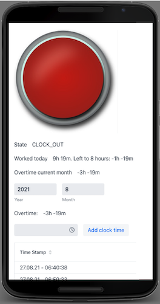

# Time clock stamper Android
is a simple service that lets you stamp in and stamp out. It gives you an overview 
about your overtime per month.

### Prerequisites
- Java 11 JDK
- A Android IDE

## How to start?
Just run the "TimeClockStamperUiApplication.java" out of your IDE.
Configuration parameters can be adjusted in the application.properties

## Built With
* [Maven](https://maven.apache.org/) - Dependency Management
* [Android-Studio](https://developer.android.com/studio/) - Android IDE

## Authors
* **Angelo Romito** - *Initial work* - [Trundicho](https://github.com/Trundicho)

## License
This project is licensed under Apache License Version 2.0 - see the [LICENSE](LICENSE) file for details

Link referral to the button images (CC0 Public Domain): https://www.maxpixel.net/Red-Activate-Power-Button-Press-Push-Button-155539
